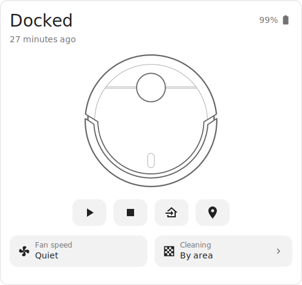

# Ecovacs Vacuum Card

A custom Lovelace card for Home Assistant that emulates the native Ecovacs more-info popup as an always-expanded card, directly on your dashboard — the same state, controls, fan speed and area-cleaning options you get when you tap the vacuum entity, without needing to open the dialog.

Built primarily for the Ecovacs (Deebot) integration, which exposes a `rooms` attribute mapping room names to numeric segment IDs, but it will work with any `vacuum.*` entity that exposes a compatible `rooms` attribute (checked via `attributes.rooms`) and the standard `vacuum` domain services.



## Features

- Emulates the existing Ecovacs more-info popup, permanently expanded on the dashboard (state, last-changed time, battery) — no tap-through needed.
- Play / pause, stop, return-to-dock, and locate buttons.
- Fan speed selector, built from the entity's `fan_speed_list` attribute.
- "Clean areas" room picker: tap to multi-select rooms, see numbered badges in selection order, then start a spot-area clean across all selected rooms in one go via `vacuum.send_command` (`spot_area`).
- **GUI editor** with three style modes:
  - **Default** - the basic card, follows your active dashboard theme.
  - **Theme** - apply any *installed* theme to just this card (e.g. [Gradient Themes](https://github.com/mycrouch/gradient-themes), Mushroom variants) without changing the rest of the view.
  - **Manual** - your own gradient from/to colours (`gradient: ["#0d2b45", "#1565c0"]` in YAML).
- No consumable (filter / brush) stats clutter — just the controls you use day to day.

## Installation

### HACS (recommended)

1. In Home Assistant, go to **HACS → Frontend**.
2. Click the **⋮** menu → **Custom repositories**.
3. Add this repository URL, category **Lovelace**.
4. Search for "Ecovacs Vacuum Card" and install.
5. Add the resource if HACS doesn't do it automatically (**Settings → Dashboards → Resources**).

### Manual

1. Copy `ecovacs-vacuum-card.js` to `/config/www/`.
2. Add it as a Lovelace resource: **Settings → Dashboards → Resources → Add Resource**
   - URL: `/local/ecovacs-vacuum-card.js`
   - Resource type: JavaScript Module
3. Add the card to a dashboard (see Configuration below).

## Configuration

```yaml
type: custom:ecovacs-vacuum-card
entity: vacuum.alfred
battery_entity: sensor.alfred_battery
```

| Option           | Required | Description                                                          |
| ---------------- | -------- | --------------------------------------------------------------------- |
| `entity`         | Yes      | Your `vacuum.*` entity.                                              |
| `battery_entity` | No       | A separate `sensor.*` entity for battery percentage, if your vacuum entity doesn't report `battery_level` directly. |

Room shortcuts are read automatically from the entity's `attributes.rooms` dictionary (`{ "kitchen": 11, "lounge": 12, ... }`) — no extra config needed. Room labels/icons are prettified from a small built-in lookup table, falling back to a title-cased version of the room key for anything not in the table.

## Attribution

The robot vacuum illustration used in this card is reused, with attribution, from the MIT-licensed [vacuum-card](https://github.com/denysdovhan/vacuum-card) by Denys Dovhan. All credit for that artwork belongs to the original author.

## Related projects

| Repo | What it is |
|---|---|
| [hass-airtouch](https://github.com/mycrouch/hass-airtouch) | Polyaire AirTouch 4/5 integration (fork) with a direct-connection mode for consoles on a different subnet/VLAN |
| [airtouch-card](https://github.com/mycrouch/airtouch-card) | Lovelace card for AirTouch 4/5 - console-style zone control with GUI editor and auto-discovery |
| [gradient-themes](https://github.com/mycrouch/gradient-themes) | 40 gradient dashboard themes (20 colours, dark + pastel variants) |
| [ecovacs-vacuum-card](https://github.com/mycrouch/ecovacs-vacuum-card) | Ecovacs/Deebot vacuum card with per-card theming (default / installed theme / manual gradient) |

## License

MIT — see [LICENSE](LICENSE).
