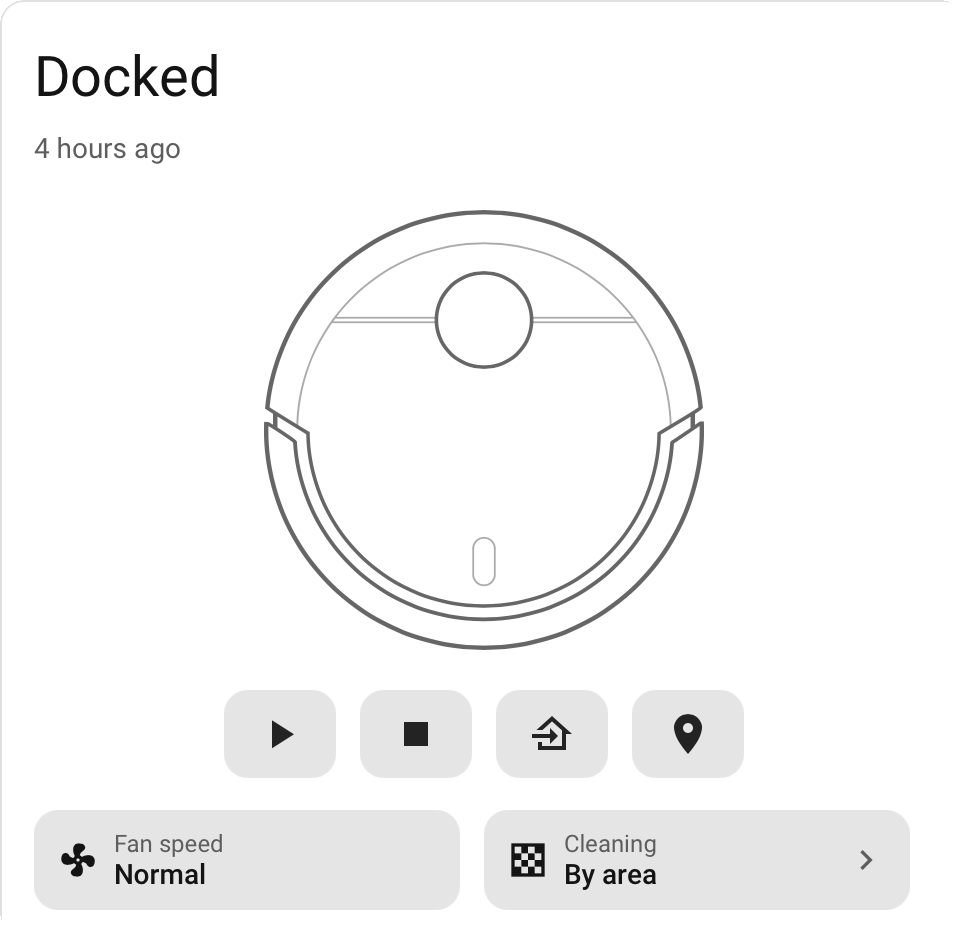
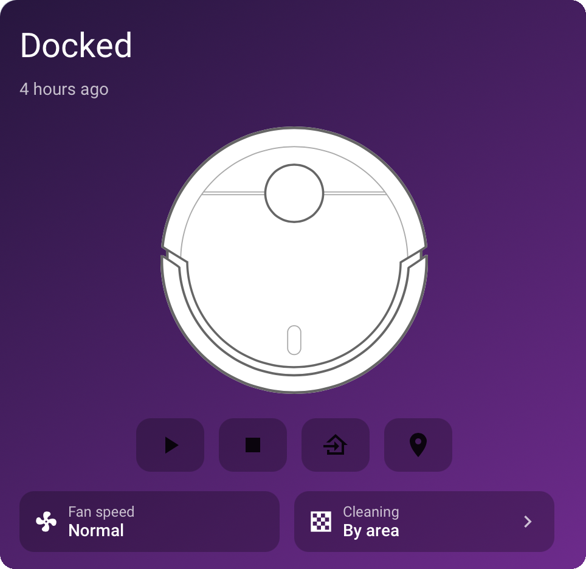
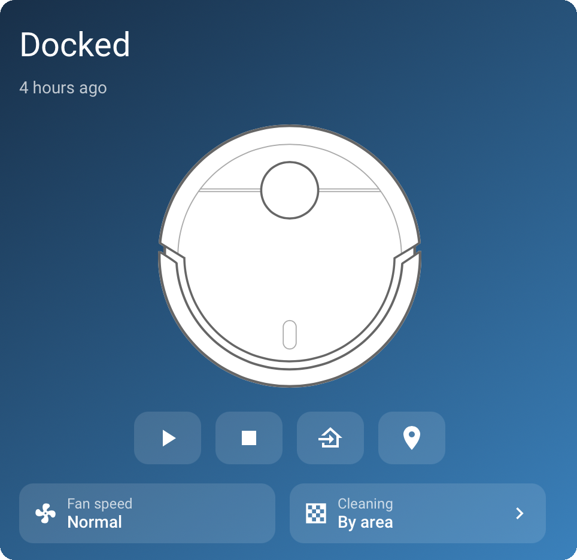

# Ecovacs Vacuum Card

A custom Lovelace card for Home Assistant that emulates the native Ecovacs more-info popup as an always-expanded card, directly on your dashboard — the same state, controls, fan speed and area-cleaning options you get when you tap the vacuum entity, without needing to open the dialog.

Built primarily for the Ecovacs (Deebot) integration, which exposes a `rooms` attribute mapping room names to numeric segment IDs, but it will work with any `vacuum.*` entity that exposes a compatible `rooms` attribute (checked via `attributes.rooms`) and the standard `vacuum` domain services.

<p align="center">
  
  
  
</p>
<p align="center"><sub>Default &middot; Theme (Gradient Purple) &middot; Manual gradient</sub></p>

## Features

- Emulates the existing Ecovacs more-info popup, permanently expanded on the dashboard (state, last-changed time, battery) — no tap-through needed.
- Play / pause, stop, return-to-dock, and locate buttons.
- Fan speed selector, built from the entity's `fan_speed_list` attribute.
- "Clean areas" room picker: tap to multi-select rooms, see numbered badges in selection order, then start a spot-area clean across all selected rooms in one go via `vacuum.send_command` (`spot_area`).
- **GUI editor** with three style modes:
  - **Default** - the basic card, follows your active dashboard theme.
  - **Theme** - apply any *installed* theme to just this card (e.g. [Gradient Themes](https://github.com/mycrouch/gradient-themes), Mushroom variants) without changing the rest of the view.
  - **Manual** - your own gradient from/to colours (`gradient: ["#0d2b45", "#1565c0"]` in YAML).
- **Weekly scheduler (v1.5)** — a Schedule section on the card face for scheduled cleans at nominated times, per schedule choosing either specific rooms or the whole house. E.g. *"Mon, Wed, Fri at 9:30 am — Lounge, Living, Kitchen"* alongside *"Tue, Thu at 10:00 am — All rooms"*. All the trigger logic runs **server-side** in Home Assistant (native `schedule` helper + one dispatcher automation, created by one-tap setup), so closing the app never breaks a schedule — the same architecture as [irrigation-schedule-card](https://github.com/mycrouch/irrigation-schedule-card).
- No consumable (filter / brush) stats clutter — just the controls you use day to day.

## Installation

### HACS (recommended)

1. In Home Assistant, go to **HACS → Frontend**.
2. Click the **⋮** menu → **Custom repositories**.
3. Add this repository URL, category **Lovelace**.
4. Search for "Ecovacs Vacuum Card" and install.
5. Add the resource if HACS doesn't do it automatically (**Settings → Dashboards → Resources**).

### Manual

1. Copy `ecovacs-vacuum-card.js` to `/config/www/`.
2. Add it as a Lovelace resource: **Settings → Dashboards → Resources → Add Resource**
   - URL: `/local/ecovacs-vacuum-card.js`
   - Resource type: JavaScript Module
3. Add the card to a dashboard (see Configuration below).

## Configuration

```yaml
type: custom:ecovacs-vacuum-card
entity: vacuum.alfred
battery_entity: sensor.alfred_battery
```

| Option            | Required | Description                                                          |
| ----------------- | -------- | --------------------------------------------------------------------- |
| `entity`          | Yes      | Your `vacuum.*` entity.                                              |
| `battery_entity`  | No       | A separate `sensor.*` entity for battery percentage, if your vacuum entity doesn't report `battery_level` directly. |
| `schedules`       | No       | Your cleaning schedules (see Scheduling below). Normally edited on the card face, not by hand. |
| `schedule_helper` | No       | The native `schedule` helper backing the scheduler. Defaults to `schedule.<vacuum>_cleaning_schedule`; created by one-tap setup. |
| `schedule_enable` | No       | The master `input_boolean` for scheduled cleaning. Defaults to `input_boolean.<vacuum>_schedule_enabled`; created by one-tap setup. |

Room shortcuts are read automatically from the entity's `attributes.rooms` dictionary (`{ "kitchen": 11, "lounge": 12, ... }`) — no extra config needed. Room labels/icons are prettified from a small built-in lookup table, falling back to a title-cased version of the room key for anything not in the table.

## Scheduling

Tap **Schedule** on the card face to expand the scheduler. First time in, an admin gets a one-tap **Set up** button that creates everything server-side — a native `schedule` helper, a master enable `input_boolean`, and a dispatcher automation (marker-tagged, updated in place on re-runs, never duplicated). No YAML.

Each schedule is: a name, the days it runs, a start time, and what to clean — tap room tiles to pick specific rooms, or the **All rooms** tile for a whole-house `vacuum.start`. The same day can carry different room sets at different times, e.g.:

```yaml
schedules:
  - id: s1
    name: Living areas
    days: [0, 2, 4]     # Mon, Wed, Fri (Monday = 0)
    time: "09:30"
    rooms: [12, 0, 6]   # segment ids from attributes.rooms
    enabled: true
  - id: s2
    name: Whole house
    days: [1, 3]        # Tue, Thu
    time: "10:00"
    all: true
    enabled: true
```

How it works: the card regenerates the schedule helper's weekly blocks from your enabled schedules, with each block carrying its clean target as block data (`rooms: "12,0,6"` or `all: true`). The dispatcher automation fires on the block's rising edge, reads that data off the helper's attributes, and starts either a `spot_area` clean of those rooms or a full clean — unless the master enable is off or the vacuum is already cleaning. Two schedules landing on the same day and time are merged (room union; *All rooms* wins). Schedule edits made on the card face are persisted back into the card's Lovelace config, so they survive refreshes.

Editing schedules and running setup require an admin user (helpers and automations are created through HA's config APIs). The card itself never runs a timer in the browser.

## Attribution

The robot vacuum illustration used in this card is reused, with attribution, from the MIT-licensed [vacuum-card](https://github.com/denysdovhan/vacuum-card) by Denys Dovhan. All credit for that artwork belongs to the original author.

## The mycrouch card collection

These Home Assistant Lovelace cards share a common design language — a clean **default** look that inherits your active theme, plus a per-card **theme** picker — so they sit together neatly on one dashboard. Pair any of them with **gradient-themes** for 40 ready-made gradient and pastel backgrounds.

| Project | What it is |
| --- | --- |
| [origami-entity-card](https://github.com/mycrouch/origami-entity-card) | Group any device's entities as a row list or chip grid |
| [pro-v-weather-card](https://github.com/mycrouch/pro-v-weather-card) | Weather-station console — clock, moon, forecast, UV, solar, wind |
| [weather-station-card](https://github.com/mycrouch/weather-station-card) | LCD-console weather station with backlight themes |
| [airtouch-card](https://github.com/mycrouch/airtouch-card) | AirTouch 4/5 AC + zone control |
| [sensibo-thermostat-card](https://github.com/mycrouch/sensibo-thermostat-card) | Sensibo thermostat with mode-coloured backgrounds |
| **ecovacs-vacuum-card** (this card) | Ecovacs/Deebot vacuum with area cleaning |
| [gradient-themes](https://github.com/mycrouch/gradient-themes) | 40 gradient + pastel dashboard themes |

## License

MIT — see [LICENSE](LICENSE).
